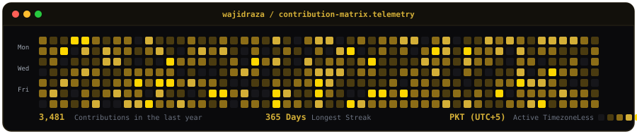

# ⚡ Wajid Raza

### Senior Full-Stack Engineer • AI Systems Architect • Microservices Craftsman

  

---

### <code>The Cipher Stack</code>

<table align="center" border="0" cellspacing="0" cellpadding="0">
  <tr>
    <td align="center" valign="middle">
      
    </td>
    <td align="center" valign="middle">
      
    </td>
  </tr>
</table>

---

### <code>Telemetry & Activity Matrix</code>

  

 

  
  &nbsp;
  

---

### 🌟 Featured Engineering Portfolio (76 Repositories)

| Project | Release Era | Primary Stack | Architecture Highlights |
| :--- | :---: | :--- | :--- |
| [**LLaMA MCP Agent Workbench**](https://github.com/wajidraza/llama-mcp-agent-workbench) | `2026` | Python, MCP Protocol, Streamlit | Multi-tool MCP agent execution workbench with local Ollama models |
| [**AI Gateway & Rate Limiting Proxy**](https://github.com/wajidraza/ai-gateway-proxy) | `2026` | FastAPI, Redis Cluster, Prometheus | Distributed token-bucket rate limiter with multi-LLM failover routing |
| [**MCP Persistent Memory Server**](https://github.com/wajidraza/mcp-sqlite-memory-server) | `2026` | TypeScript, MCP SDK, SQLite3 | Model Context Protocol server providing structured agent knowledge graphs |
| [**Lumina AI Conversational Assistant**](https://github.com/wajidraza/lumina-ai-conversational-agent) | `2025` | Next.js 15, Vercel AI SDK, Claude 3.5 | Streaming token AI chat interface with interactive artifact sidebar |
| [**CodeClarity AST Code Reviewer**](https://github.com/wajidraza/codeclarity-claude-analyzer) | `2025` | FastAPI, Anthropic SDK, Tree-sitter | AST vulnerability scanner and automated security pull request reviewer |
| [**Nexus AI Studio Multi-Model Arena**](https://github.com/wajidraza/nexus-ai-studio) | `2024` | Next.js 14, OpenAI, Claude 3, Supabase | Side-by-side generative model benchmarking with latency analytics |
| [**ATS Smart Resume Scoring Engine**](https://github.com/wajidraza/ats-smart-resume-scanner) | `2024` | Python, FastAPI, OpenAI GPT-4, PyPDF | Recruiter evaluation tool parsing resumes against job descriptions |
| [**Vortex 3D Interactive Storefront**](https://github.com/wajidraza/vortex-3d-interactive-store) | `2023` | React 18, Three.js, R3F, Tailwind | Real-time WebGL 3D product customization and material rendering |

---

### 🛠️ Technical Arsenal

#### Frontend & Interactive 3D

 

#### Backend, Microservices & Databases

 

#### AI, LLMs & Cloud DevOps

---

### 📬 Connect with Me

 

   
  <i>Scan to view live interactive portfolio</i>

 

